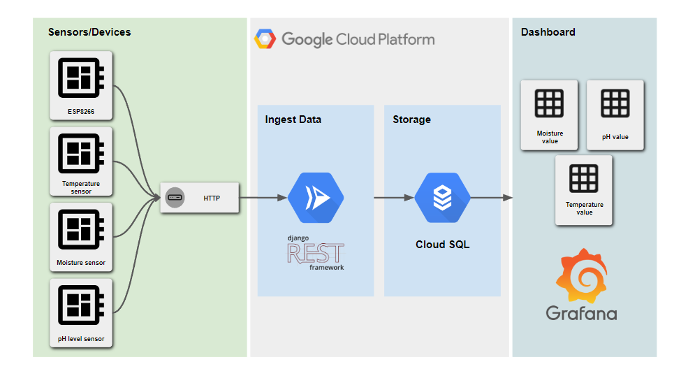
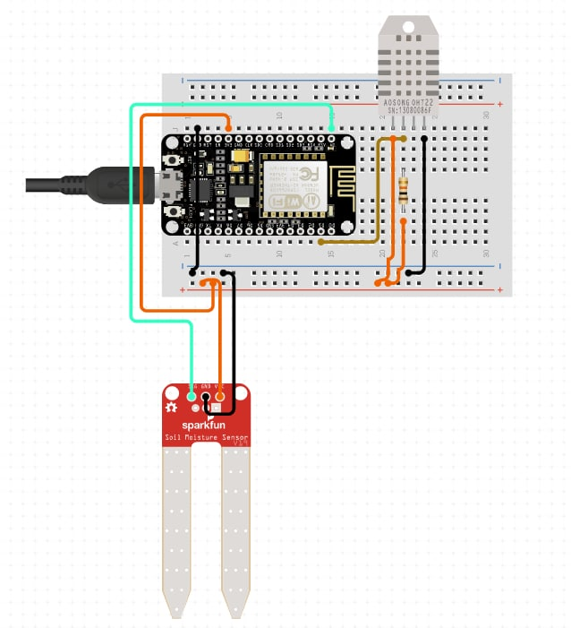
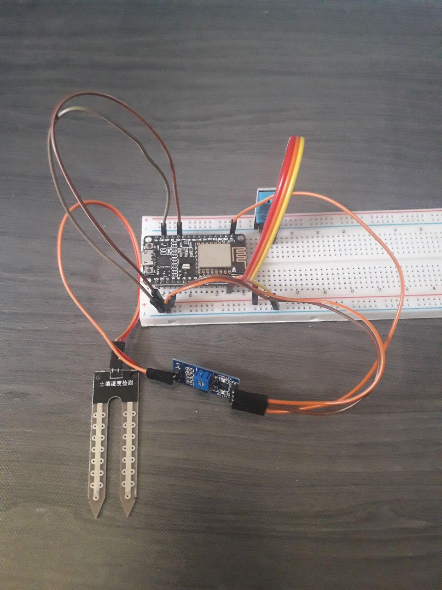
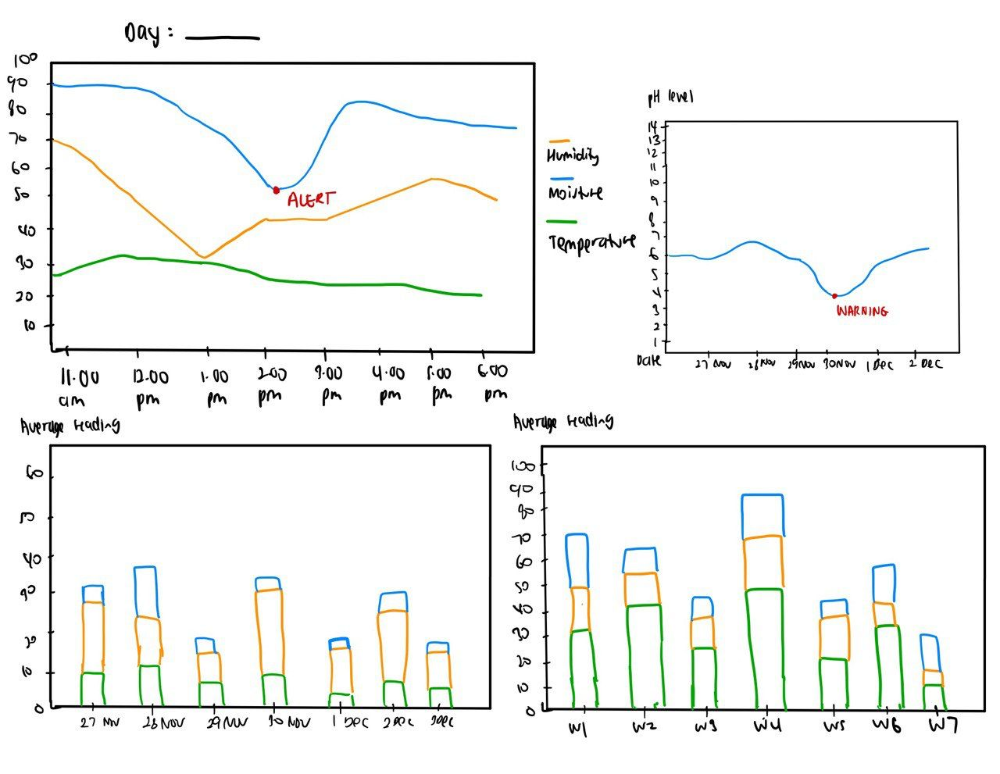

# IoT Based Agriculture Monitoring System

Group: Hustling Dinos

Members:
-  Mazlen Zulleikhaa Binti Madzalan
- Nurul Nadhirah Binti Farid Iskandar
- Solehah Najihah Binti Abd Jamal
- Sharifah Anisah Binti Syed Sahabudin

 

## Table of Contents

[1.0 Problem Statement](#10-problem-statement)
      
[2.0 System Architecture](#20-system-architecture)

[3.0 Sensor](#30-sensor)

[4.0 Cloud Platform](#40-cloud-platform)

[5.0 Dashboard](#50-dashboard)

 

## 1.0 Problem Statement 

Over 50% of population are dependent on agriculture. The major source of earnings, it also contributes to our survival by supplying meals. Today's farmers, however, confront a variety of challenges in maintaining their crops, including subpar irrigation, water management and extensive pesticide use. These challenges reduce their produce quality and increases loss to their income.

 

## 2.0 System Architecture

To overcome this problem, we adopted an agriculture monitoring system using IoT.  This system integrates three types of sensors: pH level sensor, temperature sensor and moisture sensors and send data to dashboard where user can get the current and average reading. 

 Figure 2.1: System Architecture

 

## 3.0 Sensor
Sensors and devices used in this project:
- NodeMCU ESP8266
- DHT11
- Soil moisture sensor

Proposed data transmission protocol: HTTP

 

Figure 3.1: Wiring connections

 

Figure 3.2: Hardware connections

 

## 4.0 Cloud Platform

Link to How to deploy Flask app to Heroku <a href="https://www.youtube.com/watch?v=Wf6tvi54Toc"> here. </a>.
 

## 5.0 Dashboard

 

Figure 5.1: Sketching of dashboard appearance
